<h1 align="center">
   
   Hello, I'm <a rel="nofollow noopener noreferrer" target="_blank" href="https://github.com/lawrencecebrero"><b>Lawrence Cebrero</b></a>!
</h1> 
 

  

 

  
  
  
<!--    <a href="https://hits.seeyoufarm.com">
    -->
   </a>

   

<h3 align="center">
   
 
      

         <h4>View Metrics</h4>
      

    
   

   

      

         <h4>View Skills</h4>
      

      
   Programming Languages 
   <!--
   
   
   -->
    
   
   
    
   
   
   
   <!-- 
   
   
   
   
   -->
    
   
   Frontend Frameworks  
   
   
   
   <!--
   
    
   
   
   
   
   -->
    
   
   Document and Design 
   <!--
   
   -->
   
   
   <!---->
    

   Technologies&emsp;&emsp;  Developer Tools 
   <!---->
   
   
   &emsp;&emsp;&emsp;
   
   
   <!---->
   <!--
   
   -->
    
   
  Databases<!--&emsp;&emsp;&emsp;&emsp;&emsp;OSes-->  
   
   <!--
   &emsp;
   
   
    -->
</h3>

 

